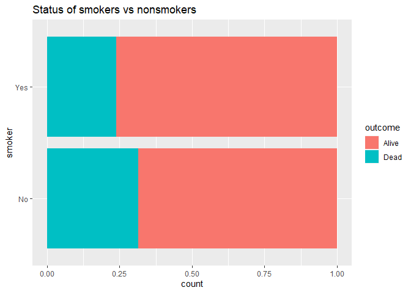
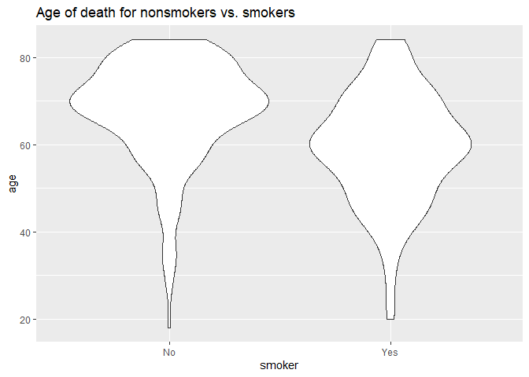
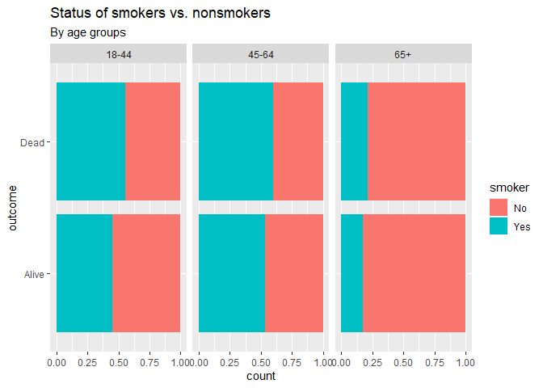
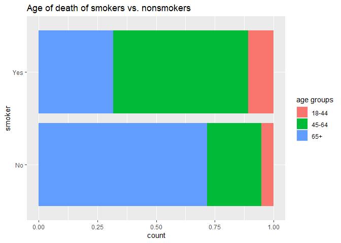

Lab 06b - Simpson’s paradox
================
Fanyi Zeng
03/01/22

### Load packages and data

``` r
library(tidyverse) 
library(mosaicData) 
data(Whickham)
?Whickham
```

A study conducted of Whickham, England recorded participants’ age,
smoking status at baseline, and then 20 years later recorded their
health outcome.

We can see that the observational dataset has three variables: outcome
(alive or dead), smoker (yes or no), age. We might expect to see that
smokers die at a younger age than nonsmokers.

``` r
head(Whickham)
```

    ##   outcome smoker age
    ## 1   Alive    Yes  23
    ## 2   Alive    Yes  18
    ## 3    Dead    Yes  71
    ## 4   Alive     No  67
    ## 5   Alive     No  64
    ## 6   Alive    Yes  38

``` r
Whickham %>%
  count(smoker, outcome) %>%
  group_by(smoker) %>%
  mutate(prop_outcome = n/sum(n))
```

    ## # A tibble: 4 x 4
    ## # Groups:   smoker [2]
    ##   smoker outcome     n prop_outcome
    ##   <fct>  <fct>   <int>        <dbl>
    ## 1 No     Alive     502        0.686
    ## 2 No     Dead      230        0.314
    ## 3 Yes    Alive     443        0.761
    ## 4 Yes    Dead      139        0.239

Let’s examine the relationship between smoker and age of death. The
first plot does not tell us much. But, we can see from the second plot
that, among people who are dead, most smokers died at age of 60 yr
whereas most nonsmokers died at age of 70 yr.

``` r
Whickham %>%
  ggplot(aes(y = smoker, fill = outcome)) +
  geom_bar(position = "fill") +
  labs(title = "Status of smokers vs nonsmokers")
```

<!-- -->

``` r
Whickham %>%
  filter(outcome == "Dead") %>%
  ggplot(aes(x = smoker, y = age)) +
  geom_violin() +
  labs(title = "Age of death for nonsmokers vs. smokers")
```

<!-- -->

Now let’s categorize people into different age groups and visualize the
data again.

``` r
Whickham <- Whickham %>%
  mutate(age_cat = case_when(
    age <= 44 ~ "18-44",
    age > 44 & age <= 64 ~ "45-64",
    age > 64 ~ "65+"))
```

We can see that, among people who are dead, % smokers exceeded 50% in
the first two age groups, but % smokers was much lower than % nonsmokers
in the last age group. This tells us that, again, smokers died at an
early age than nonsmokers.

``` r
Whickham %>%
  count(age_cat, smoker, outcome) %>%
  group_by(age_cat) %>%
  mutate(prop_outcome = n/sum(n))
```

    ## # A tibble: 12 x 5
    ## # Groups:   age_cat [3]
    ##    age_cat smoker outcome     n prop_outcome
    ##    <chr>   <fct>  <fct>   <int>        <dbl>
    ##  1 18-44   No     Alive     327       0.524 
    ##  2 18-44   No     Dead       12       0.0192
    ##  3 18-44   Yes    Alive     270       0.433 
    ##  4 18-44   Yes    Dead       15       0.0240
    ##  5 45-64   No     Alive     147       0.329 
    ##  6 45-64   No     Dead       53       0.119 
    ##  7 45-64   Yes    Alive     167       0.374 
    ##  8 45-64   Yes    Dead       80       0.179 
    ##  9 65+     No     Alive      28       0.115 
    ## 10 65+     No     Dead      165       0.679 
    ## 11 65+     Yes    Alive       6       0.0247
    ## 12 65+     Yes    Dead       44       0.181

``` r
Whickham %>%
  ggplot(aes(y = outcome, fill = smoker)) +
  geom_bar(position = "fill") +
  facet_wrap(~age_cat) +
  labs(title = "Status of smokers vs. nonsmokers", subtitle = "By age groups")
```

<!-- -->

We can see this pattern more clearly by filtering in people who are
dead. Most smokers died between the age of 45-64, whereas most
nonsmokers died after 65. Besides, there are more smokers than
nonsmokers who died between 18-44.

``` r
Whickham %>%
  filter(outcome == "Dead") %>%
  ggplot(aes(y = smoker, fill = age_cat)) +
  geom_bar(position = "fill") +
  labs(title = "Age of death of smokers vs. nonsmokers", fill = "age groups")
```

<!-- -->
